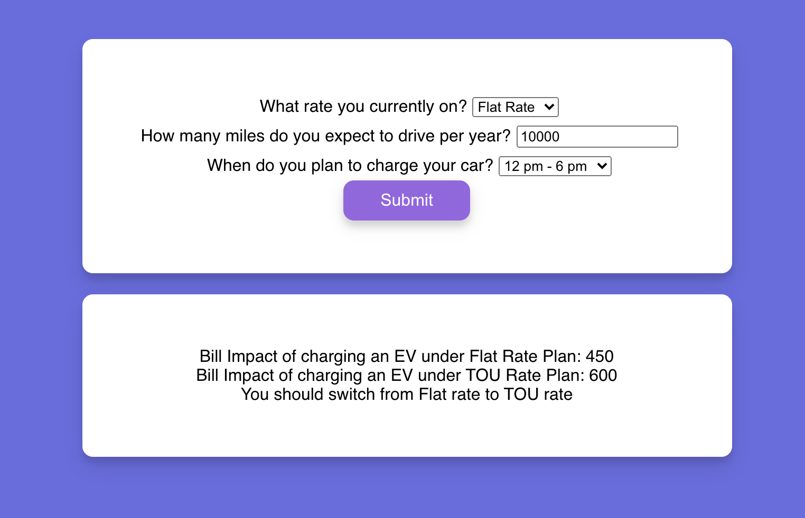

# Cost of Charging an Electric Vehicle

The project is deployed to Heroku and here is the [link](https://mysterious-savannah-79178.herokuapp.com/)

This project was bootstrapped with [Create React App](https://github.com/facebook/create-react-app). There are two display components: **form** and **results**. The calculation functions are in the app.js file.
pre-EV Calculation is based on annual consumption of the Electricity:Facility in the [load profile](https://openei.org/datasets/files/961/pub/EPLUS_TMY2_RESIDENTIAL_BASE/USA_NY_Buffalo.725280_TMY2.csv).

For TOU rate, rush hour total consumption is calculated by using the data for 12pm - 5pm inclusively. Non rush hour total consumption is calculated by using data from 6pm - 11am inclusively.

## Available Scripts

In the project directory, you can run:

### `yarn start`

Runs the app in the development mode.\
Open [http://localhost:3000](http://localhost:3000) to view it in the browser.

The page will reload if you make edits.\
You will also see any lint errors in the console.

### `yarn test`

Launches the test runner in the interactive watch mode.\
See the section about [running tests](https://facebook.github.io/create-react-app/docs/running-tests) for more information.

### `yarn build`

Builds the app for production to the `build` folder.\
It correctly bundles React in production mode and optimizes the build for the best performance.

